<div align="center">

# Linux-DotFiles

A minimal and modern **Arch Linux + Hyprland** desktop focused on **development**, **productivity**, and **gaming**.

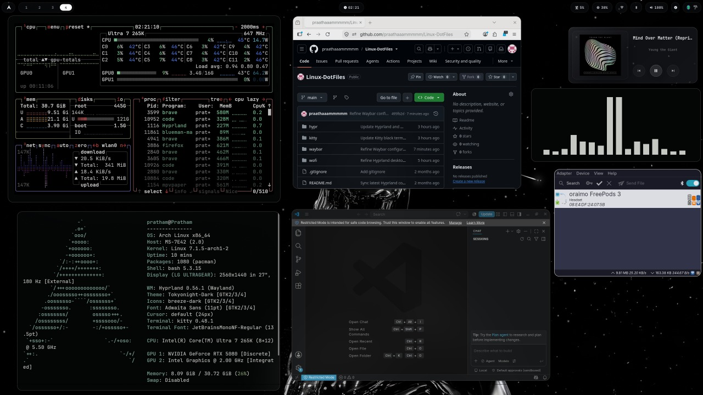

</div>

---

# ✨ Features

- Minimal Hyprland desktop
- Floating glass Waybar
- Tokyo Night inspired theme
- Fast Wofi launcher
- Kitty terminal
- SwayNC notifications
- Hyprlock + Hypridle
- NVIDIA friendly
- Gaming ready
- Developer-focused workflow

---

# 🖥 Components

| Component | Software |
|-----------|----------|
| Window Manager | Hyprland |
| Status Bar | Waybar |
| Launcher | Wofi |
| Terminal | Kitty |
| Notifications | SwayNC |
| Lock Screen | Hyprlock |
| Idle Daemon | Hypridle |
| Bluetooth | Blueman |
| Network | NetworkManager Applet |
| Wallpaper | mpvpaper |
| Theme | Tokyo Night |

---

# 📸 Screenshots

## Desktop


---

## Wofi Launcher

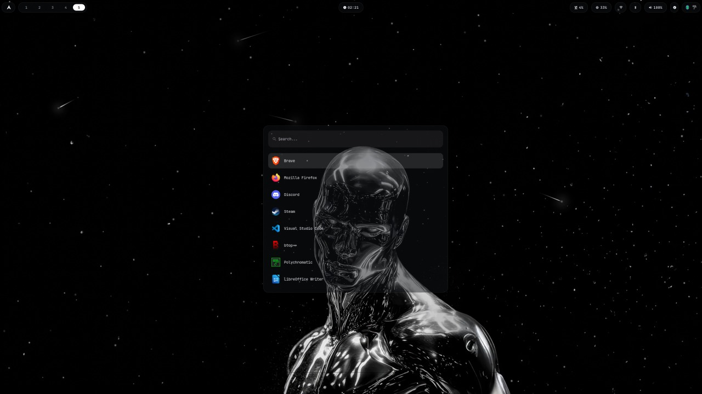

---

## Development Workspace

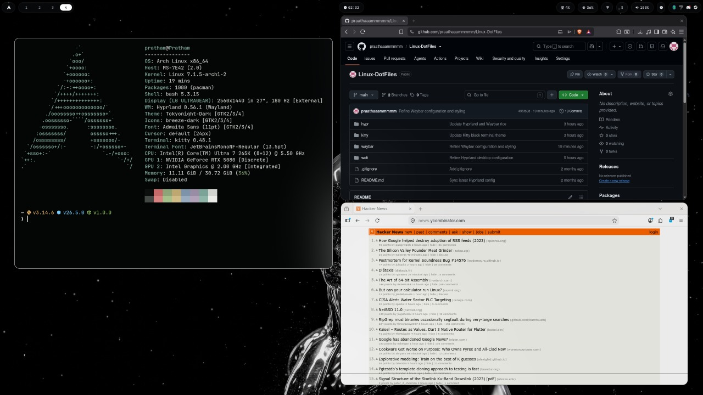

---

## Gaming Setup

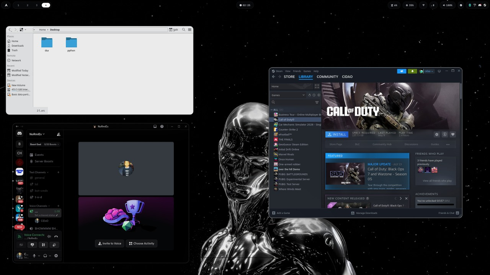

---

## Daily Applications

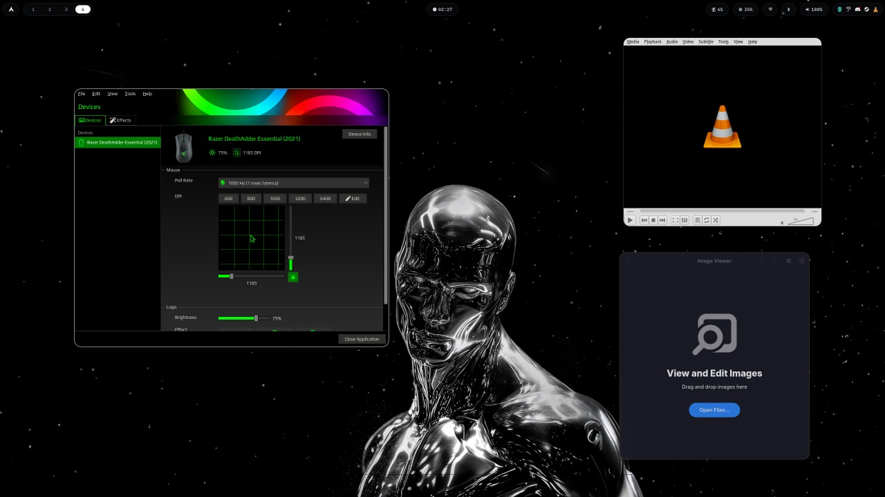

---

## 🎬 Live Wallpapers

<table>
<tr>
<td width="50%">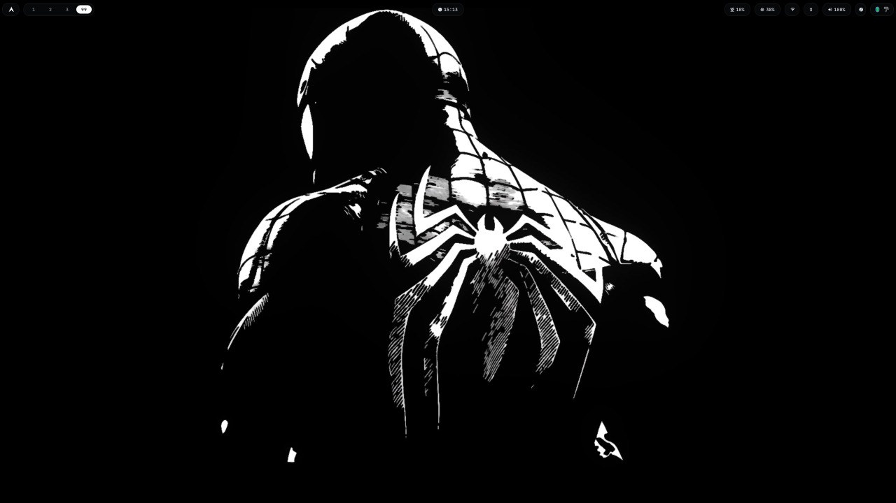</td>
<td width="50%">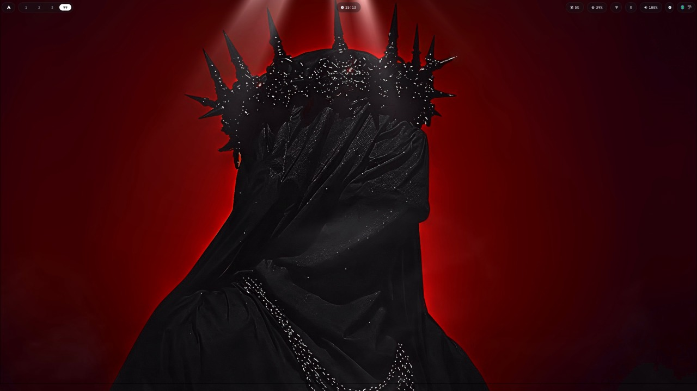</td>
</tr>
<tr>
<td width="50%">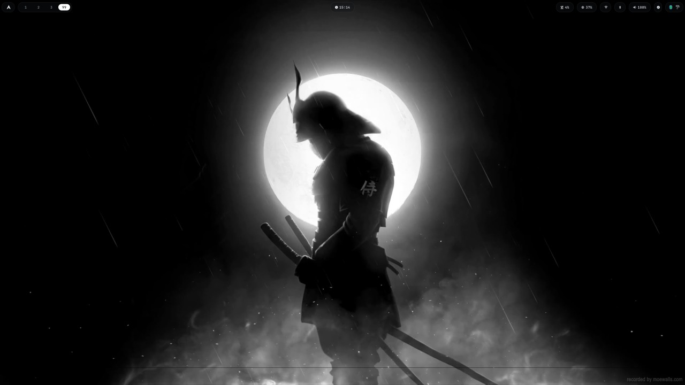</td>
<td width="50%">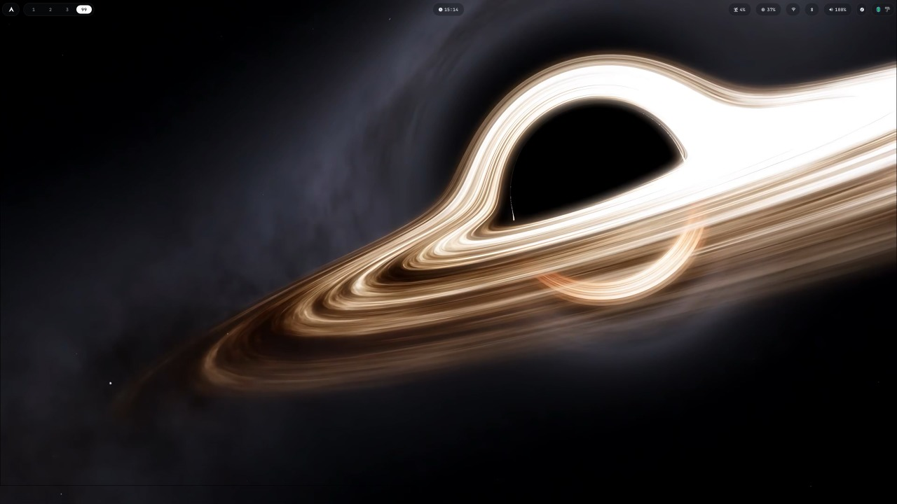</td>
</tr>
<tr>
<td width="50%">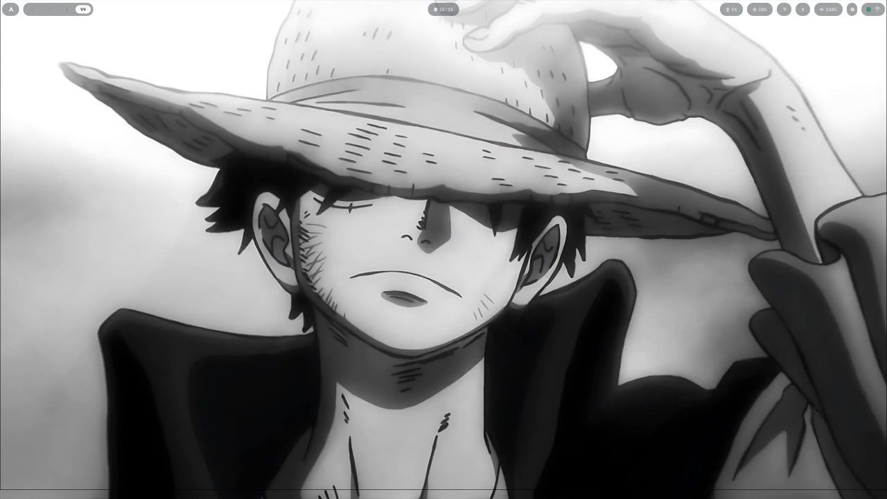</td>
<td width="50%">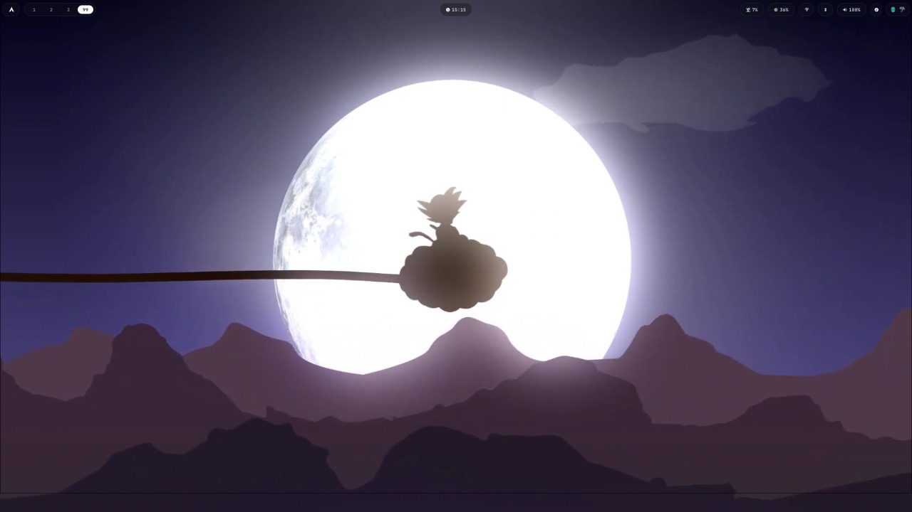</td>
</tr>
<tr>
<td width="50%">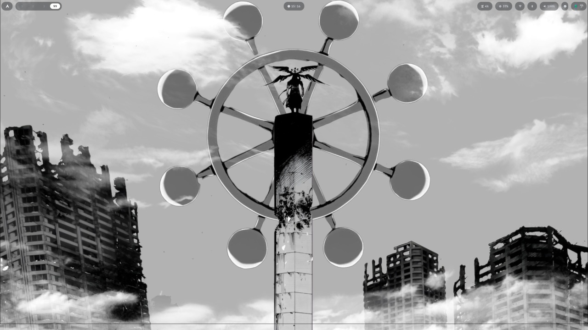</td>
<td width="50%">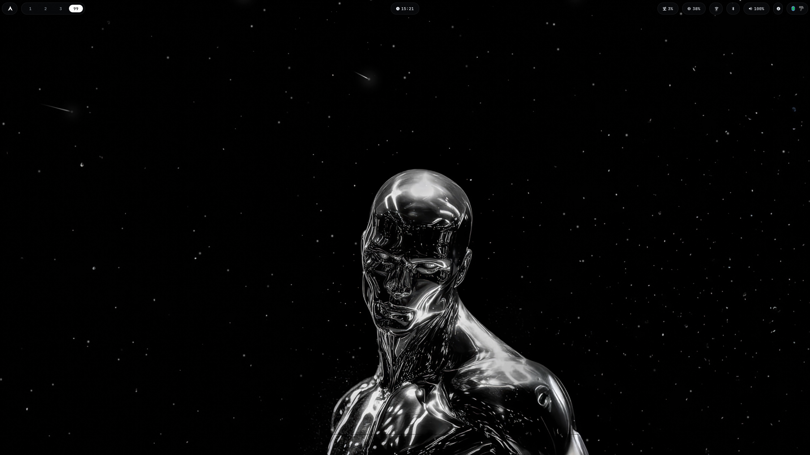</td>
</tr>
</table>

---

# 🚀 Installation

## Clone the repository

```bash
git clone https://github.com/praathaaammmmm/Linux-DotFiles.git
cd Linux-DotFiles
```

## Install the core packages

```bash
sudo pacman -S \
hyprland \
waybar \
kitty \
wofi \
hyprlock \
hypridle \
swaync \
blueman \
network-manager-applet
```

## Install the required fonts

```bash
sudo pacman -S \
ttf-jetbrains-mono-nerd \
noto-fonts \
noto-fonts-emoji
```

## Copy the configuration

```bash
cp -r hypr ~/.config/
cp -r waybar ~/.config/
cp -r kitty ~/.config/
cp -r wofi ~/.config/
```

Reload Hyprland or restart the applications.

---

# 📦 Optional Software

These applications are used in the screenshots and integrate well with the setup.

- Brave
- Firefox
- Visual Studio Code
- Discord
- Steam
- Spotify
- VLC
- btop
- fastfetch
- mpvpaper
- Polychromatic

---

# ⌨ Useful Keybindings

| Shortcut | Action |
|----------|--------|
| Super + Q | Open Kitty |
| Super + E | Open File Manager |
| Super + D | Open Wofi |
| Super + C | Close Active Window |
| Super + F | Toggle Fullscreen |
| Super + V | Toggle Floating |
| Super + L | Lock Screen |
| Super + M | Toggle Desktop |
| Super + R | Open nwg-drawer |
| Super + G | Toggle Dashboard Workspace |
| Super + Shift + G | Move Window to Dashboard Workspace |
| Super + Shift + V | Clipboard History |
| Super + Shift + S | Screenshot Selection |
| Super + H / J / K / L | Move Focus |
| Alt + Tab | Next Workspace |
| Alt + Shift + Tab | Previous Workspace |
| Super + 1-0 | Switch Workspace |
| Super + Shift + 1-0 | Move Window to Workspace |
| Super + Left Click | Move Window |
| Super + Right Click | Resize Window |
| Volume Keys | Volume Control |

---

# 🔤 Fonts

- JetBrainsMono Nerd Font
- Noto Fonts
- Noto Emoji

---

# 📂 Repository Structure

```text
.
├── assets/
├── hypr/
├── kitty/
├── waybar/
├── wofi/
├── README.md
```

---

<div align="center">

### ⭐ If you like this setup, consider giving the repository a star!

It motivates future improvements and helps others discover the project.

</div>
